# 📸 Evidencias Completas de Ejecución y Consultas: MySQL (Motor 1)

**Proyecto:** Proyecto 04 - ClimaTec  
**Asignatura:** Base de Datos II  
**Estudiante:** Brayan David Arévalo Luna  
**Motor:** MySQL 8.0 (`bd_clima_tec`)  

---

## 1. Estructura DDL y Tablas del Sistema
Validación de las 16 tablas del sistema (6 RBAC + 10 ClimaTec) creadas correctamente en `bd_clima_tec`.

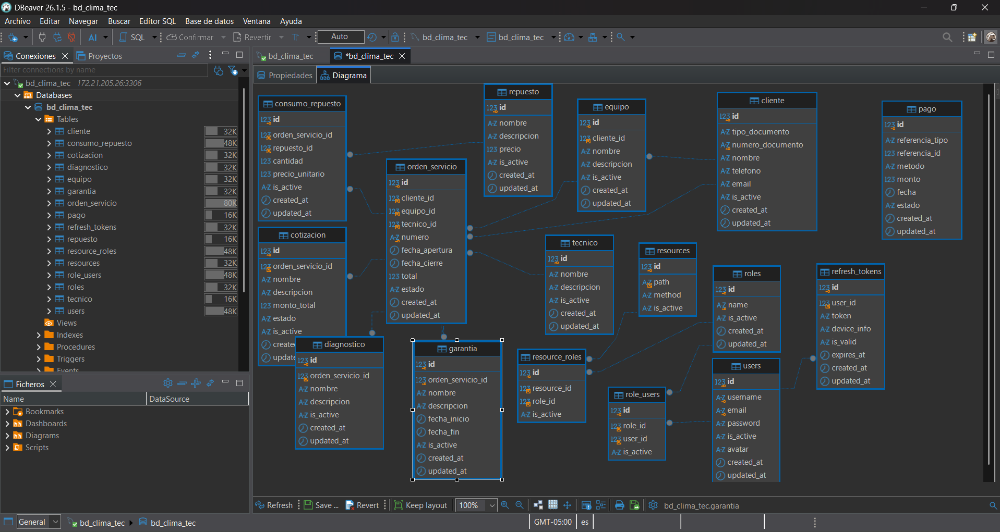

---

## 2. Inserción Manual por Interfaz Gráfica (GUI)
* **Borrador de Inserción (Resaltado en verde):** 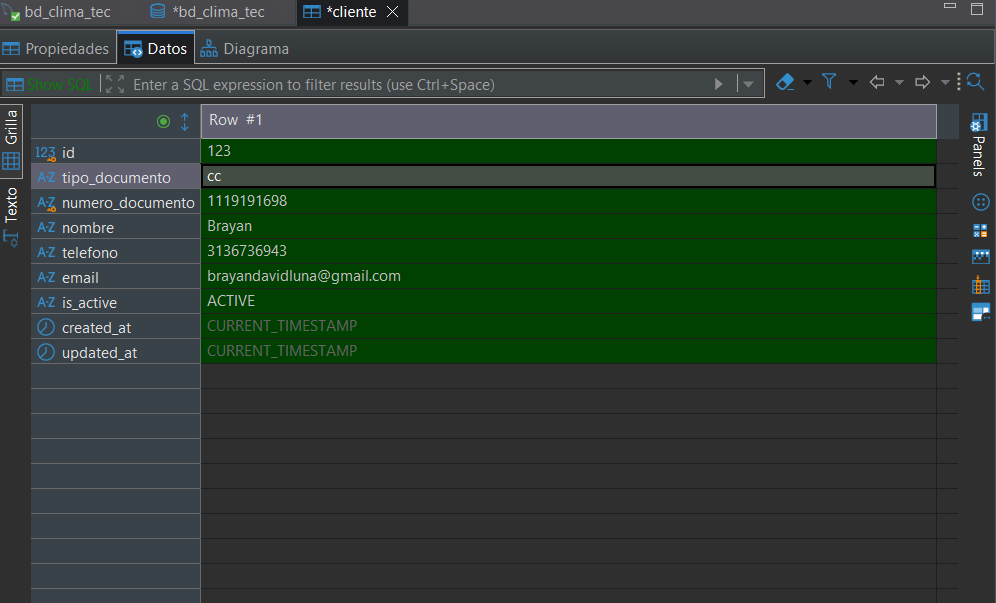
* **Registro Guardado (`Ctrl + S`):** 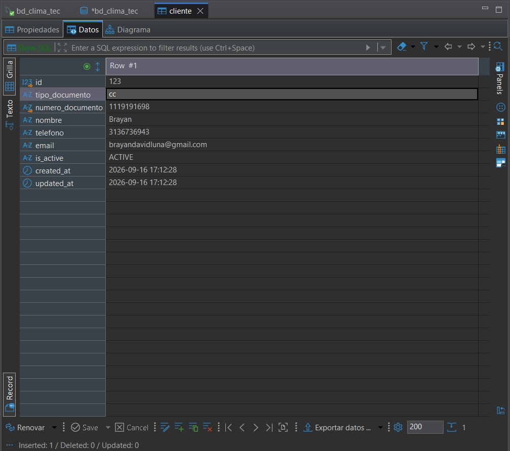

---

## 3. Guía de Consultas SQL (DML) - Ejecución en DBeaver

### 3.1 Filtrado Condicional (`WHERE`)
* **Igualdad Exacta:** 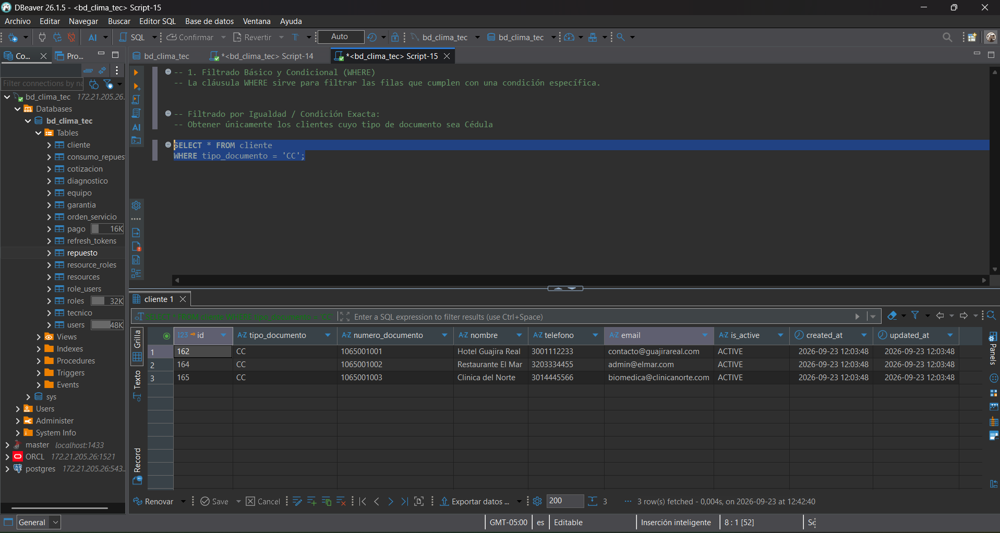
* **Operadores Lógicos (`OR`):** 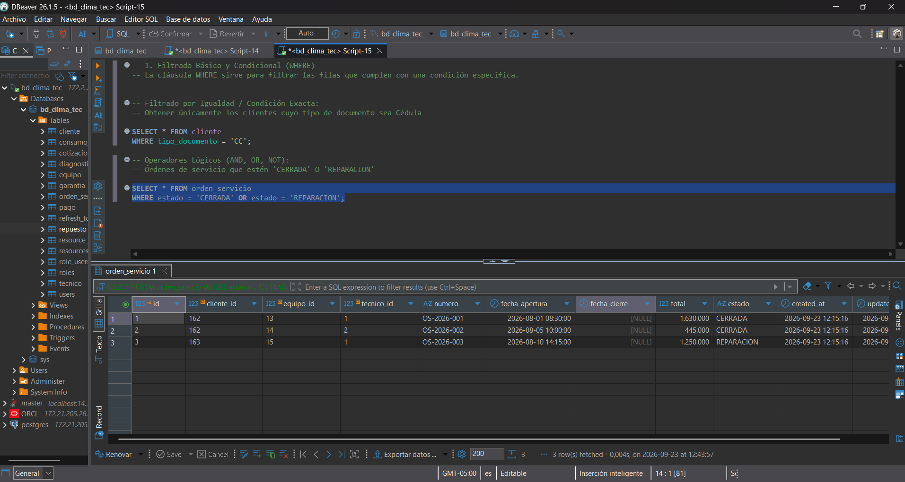
* **Patrones de Texto (`LIKE`):** 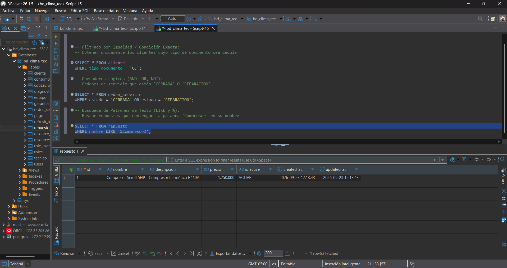
* **Rangos de Fechas (`BETWEEN`):** 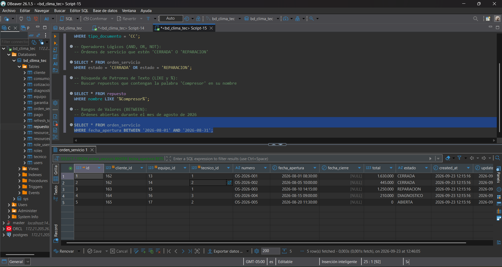
* **Listas de Opciones (`IN`):** 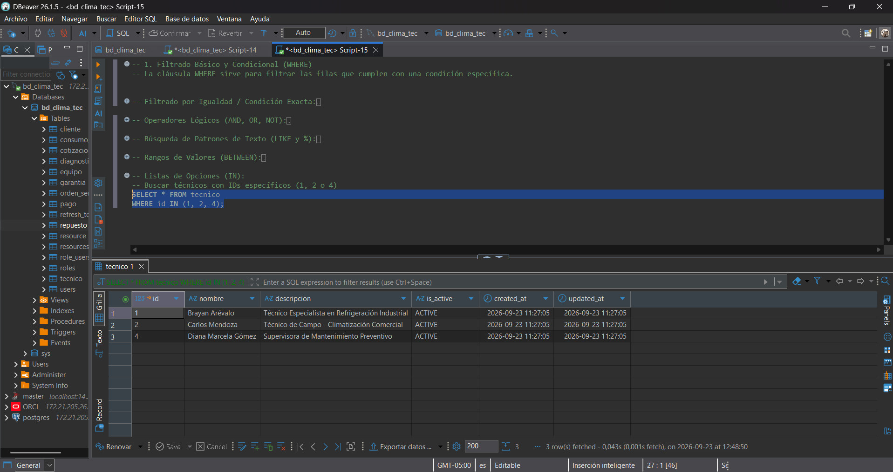
* **Manejo de Nulos (`IS NULL`):** 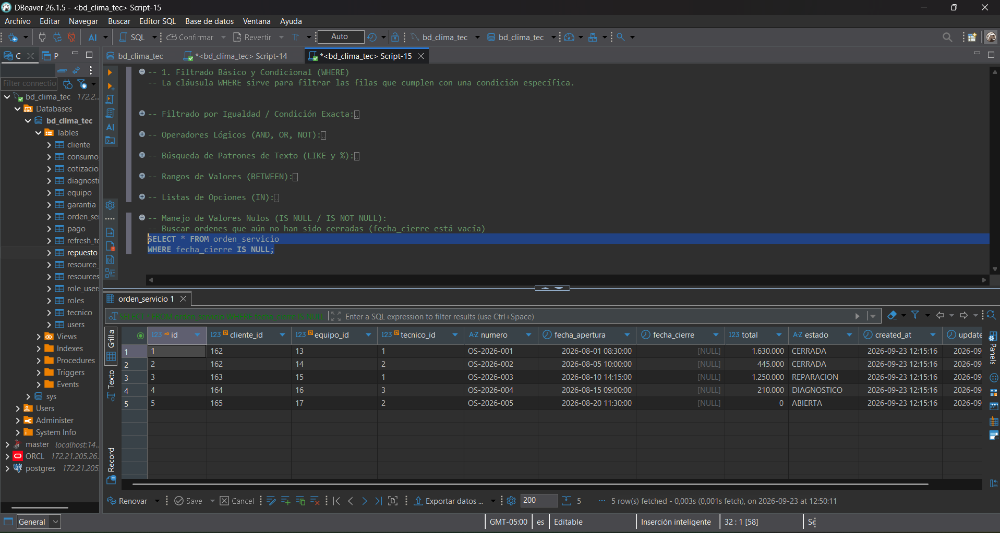

---

### 3.2 Ordenamiento (`ORDER BY`)
* **Orden Descendente de Precios:** 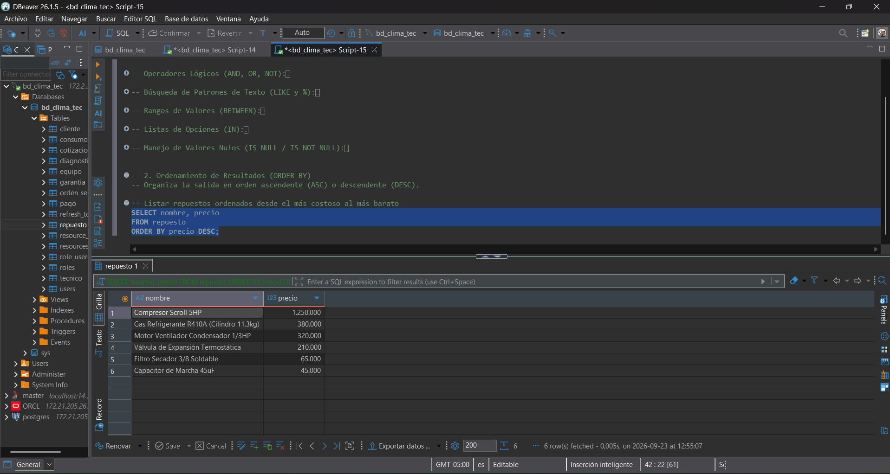

---

### 3.3 Agrupaciones y Métricas (`GROUP BY` / `HAVING`)
* **Conteo de Órdenes por Técnico (`GROUP BY`):** 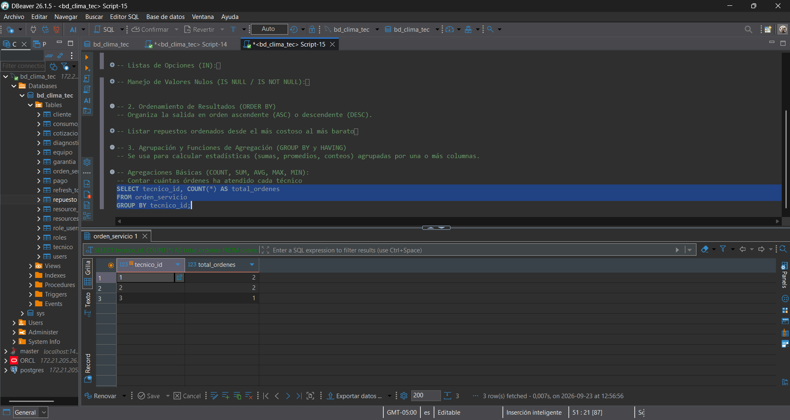
* **Filtrado de Grupos con > 1 Órden (`HAVING`):** 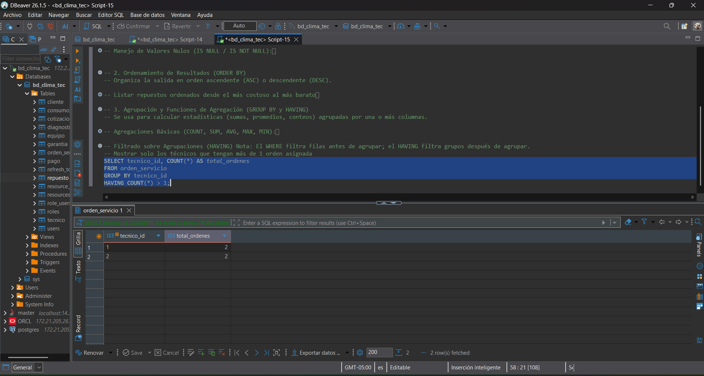

---

### 3.4 Uniones Multitabla (`JOIN`)
* **Relación Cliente-Equipo (`INNER JOIN`):** 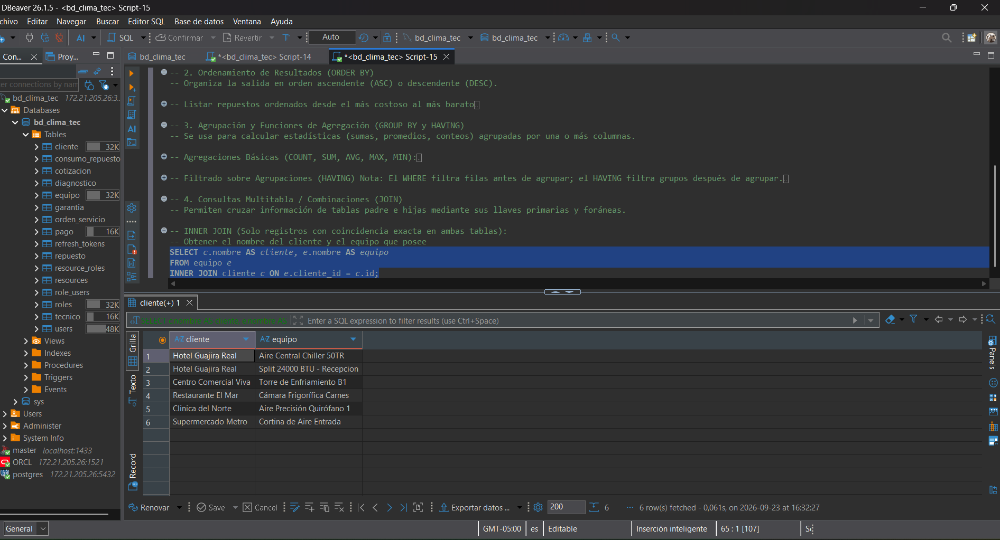
* **Órdenes y Diagnósticos (`LEFT JOIN`):** 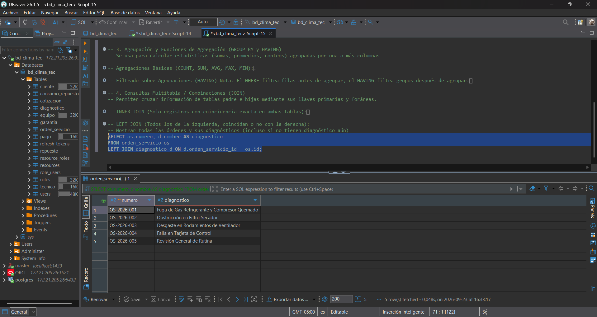

---

### 3.5 Subconsultas y Límites
* **Repuestos sobre el Precio Promedio:** 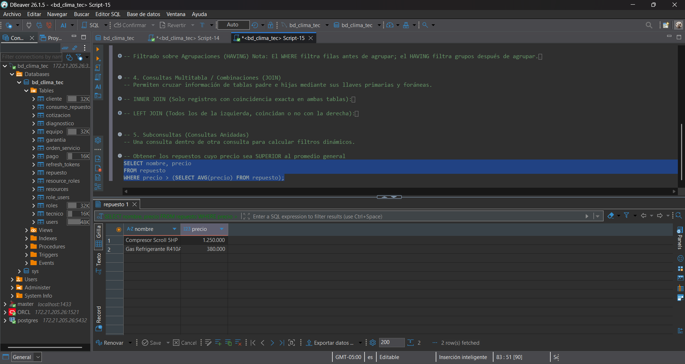
* **Paginación (`LIMIT 3`):** 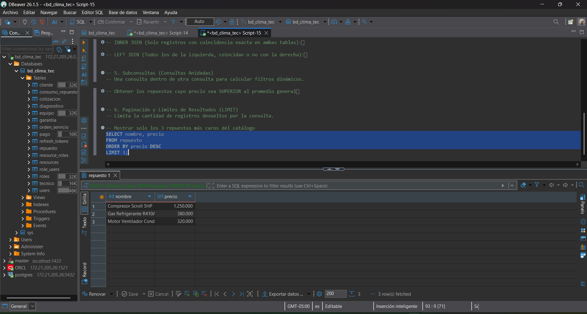
