# 📘 Evidencias de Implementación y Consultas DML: PostgreSQL 17 (Motor 2)

**Proyecto:** Proyecto 04 - ClimaTec  
**Asignatura:** Base de Datos II  
**Estudiante:** Brayan David Arévalo Luna  

---

## 1. Estructura DDL y Pruebas por Interfaz Gráfica (GUI)

Se desplegaron las 16 tablas correspondientes al modelo RBAC y al dominio ClimaTec dentro del esquema `public` de PostgreSQL.

* **Estructura de Tablas:**  
  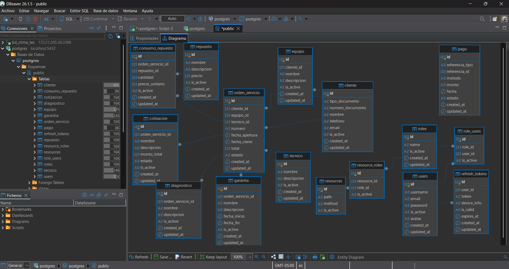

* **Prueba GUI (Modo Borrador / Inserción Pendiente):**  
  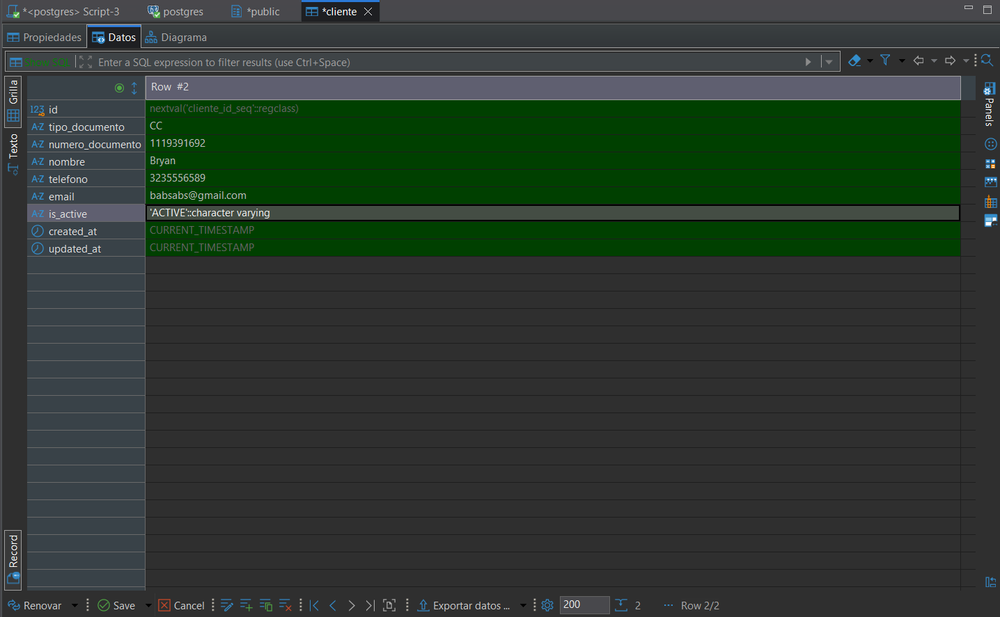

* **Prueba GUI (Confirmación de Transacción / Commit Guardado):**  
  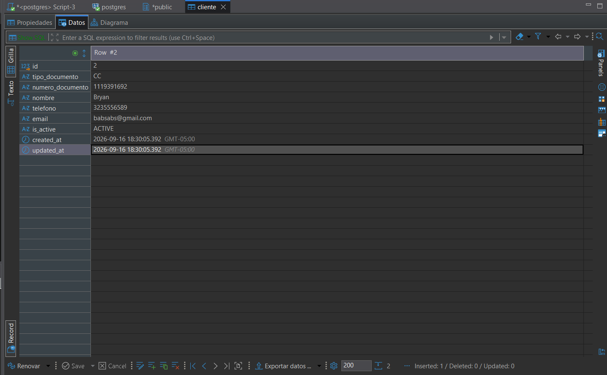

---

## 2. Consultas y Reportes DML Avanzados en DBeaver

### 2.1 Filtrado Básico y Condicional (WHERE)
1. **Filtrado por Igualdad Exacta:**  
   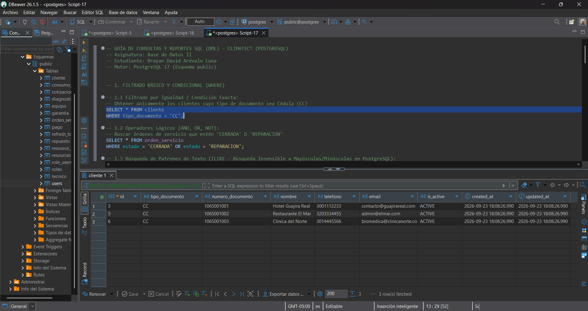

2. **Operadores Lógicos (`OR`):**  
   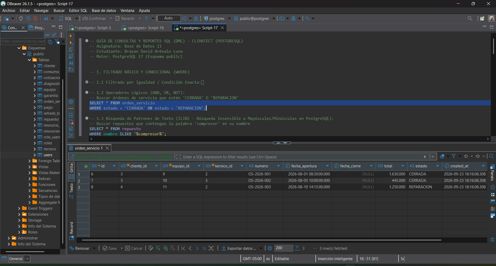

3. **Búsqueda por Patrón de Texto Insensible a Mayúsculas (`ILIKE`):**  
   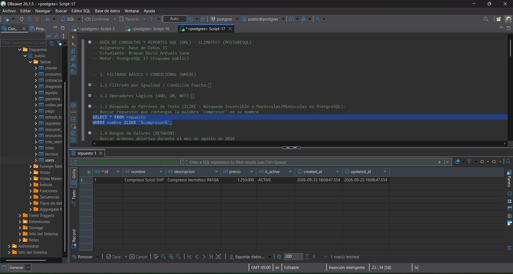

4. **Rangos de Fechas (`BETWEEN`):**  
   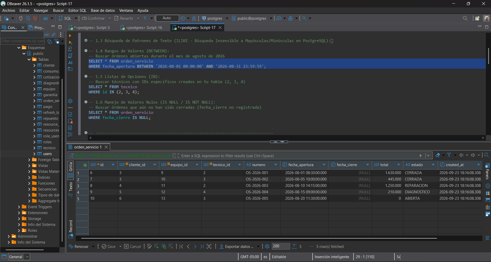

5. **Lista de Opciones (`IN`):**  
   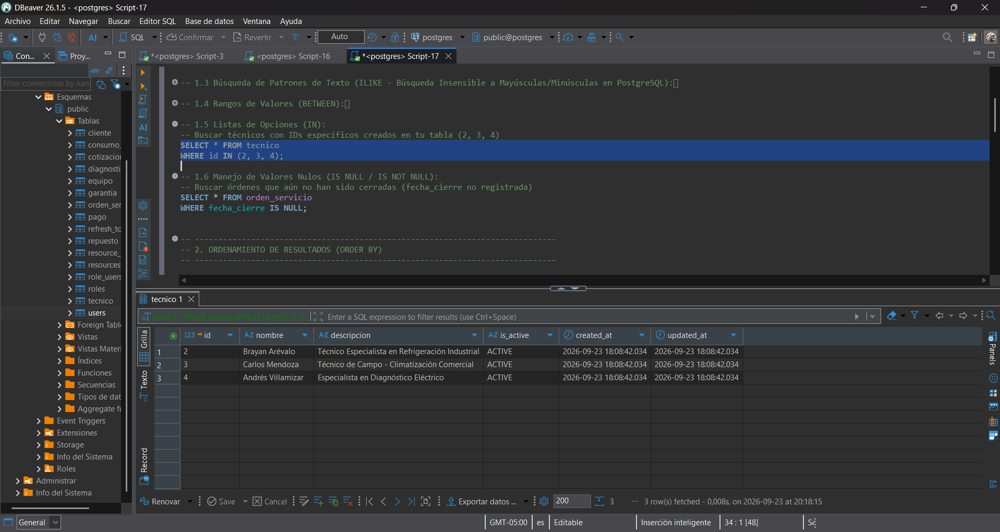

6. **Manejo de Valores Nulos (`IS NULL`):**  
   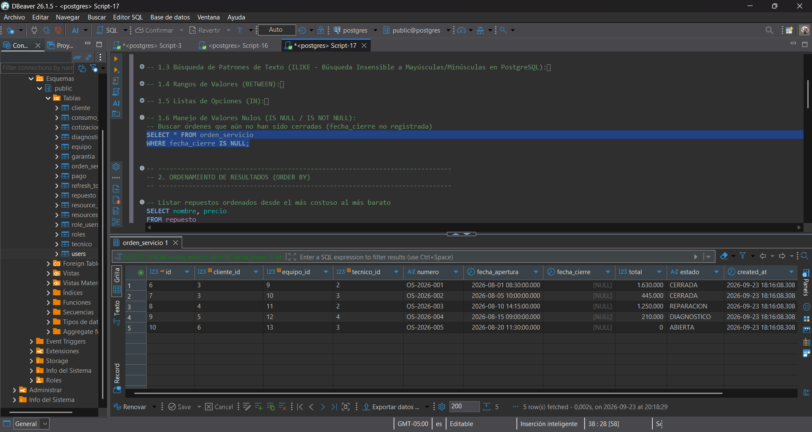

---

### 2.2 Ordenamiento de Resultados
* **Ordenamiento Descendente de Precios (`ORDER BY DESC`):**  
  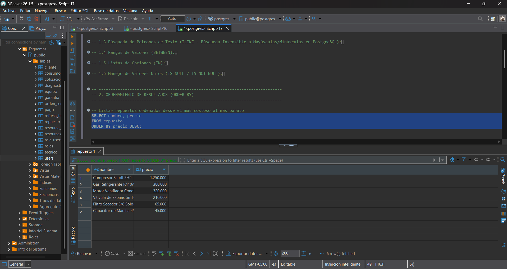

---

### 2.3 Agrupación y Funciones de Agregación
1. **Conteo por Técnico (`GROUP BY`):**  
  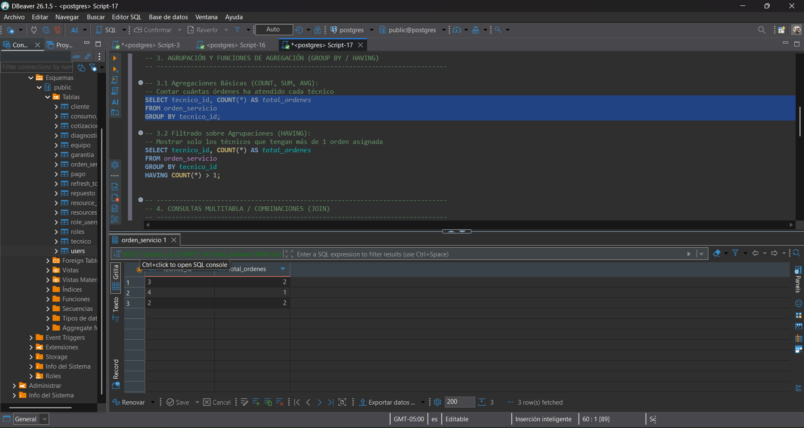

2. **Filtro sobre Agregaciones (`HAVING`):**  
  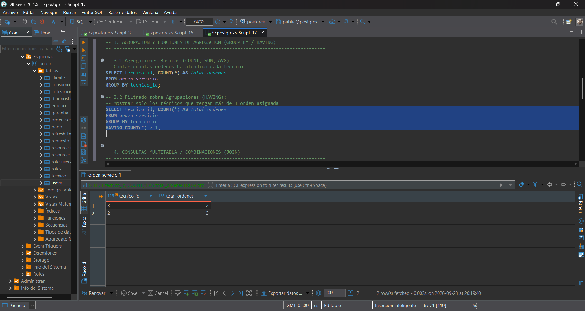

---

### 2.4 Combinaciones Multitabla (JOIN)
1. **Coincidencia Exacta (`INNER JOIN`):**  
  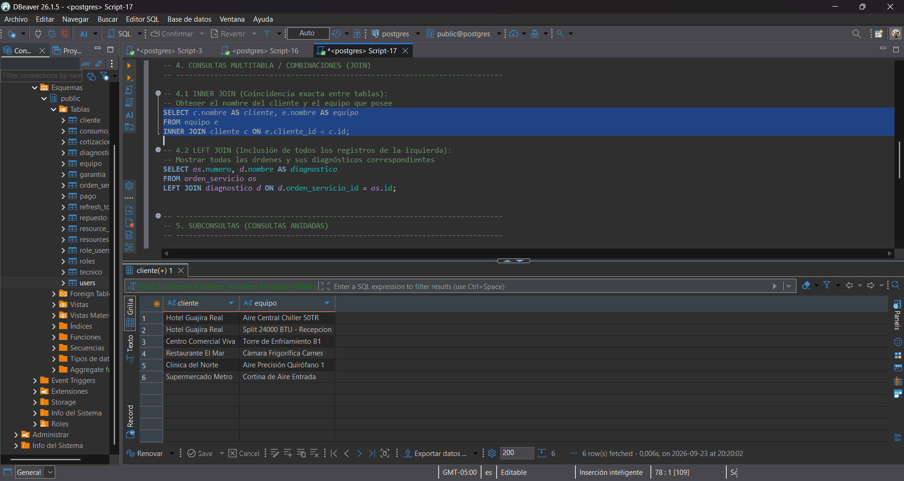

2. **Inclusión Total de la Izquierda (`LEFT JOIN`):**  
  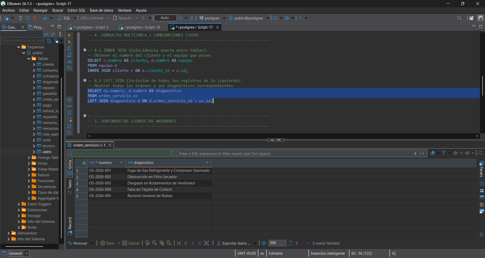

---

### 2.5 Subconsultas y Paginación
1. **Subconsulta Anidada sobre Promedio (`AVG`):**  
  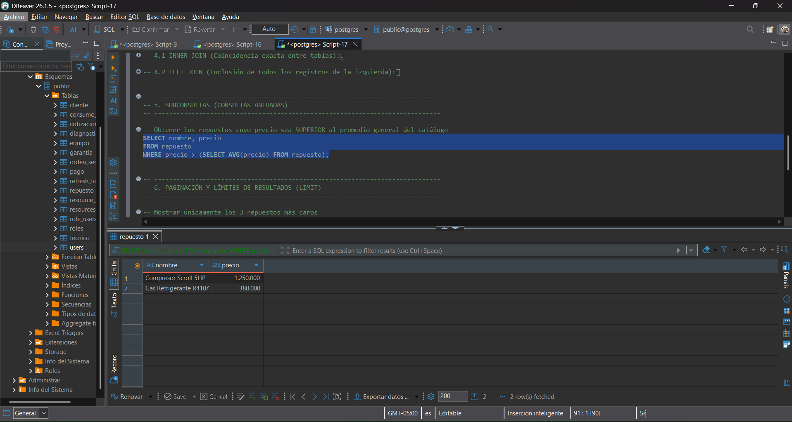

2. **Paginación de Resultados (`LIMIT`):**  
  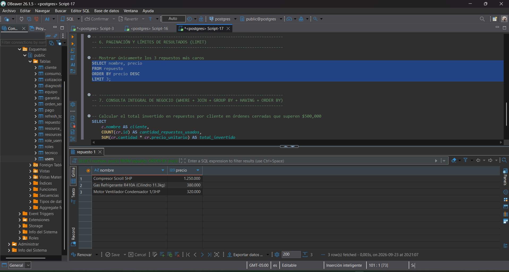

---

### 2.6 Reporte Integrador de Negocio
* **Consulta Consolidada (`JOIN` + `GROUP BY` + `HAVING` + `ORDER BY`):**  
  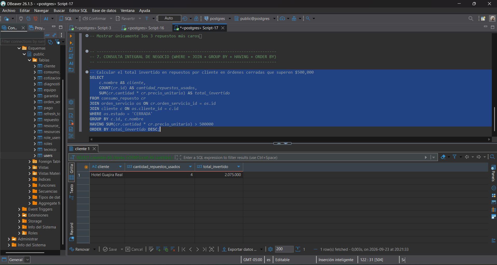
