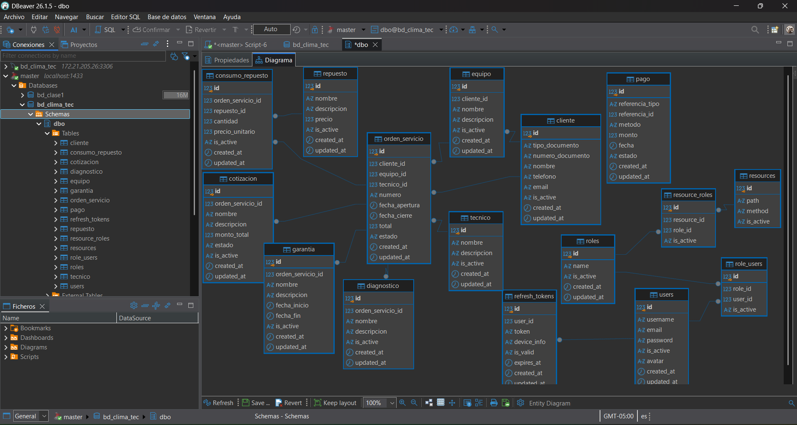
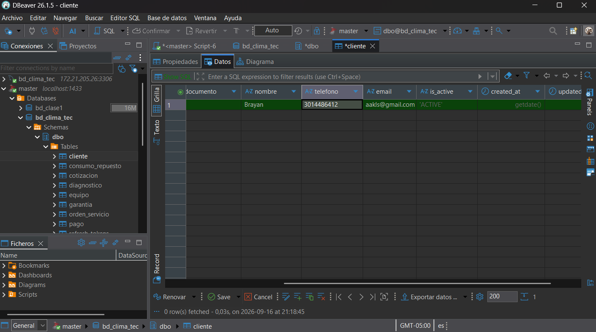
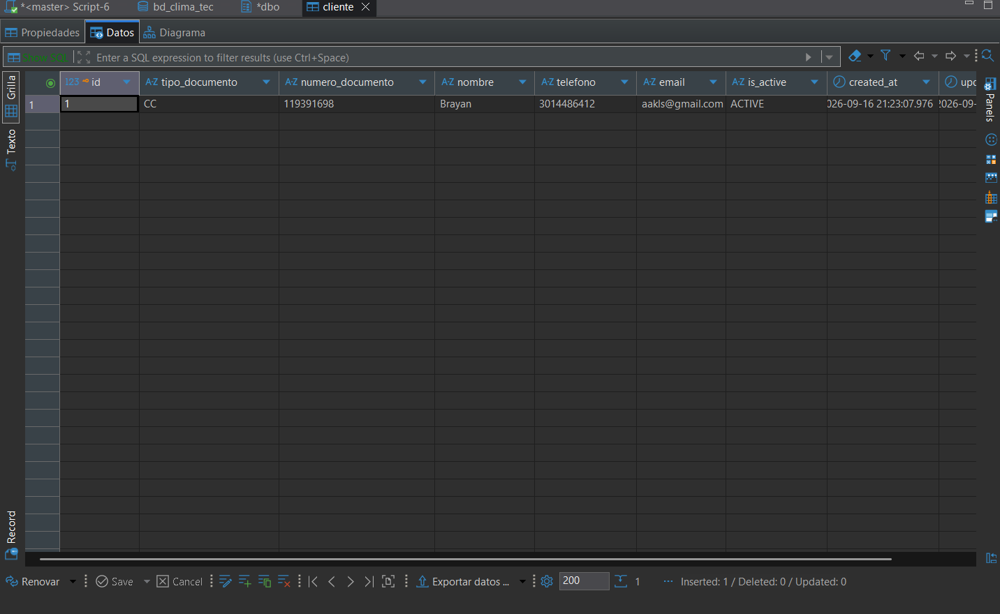

# Evidencias de Implementación: SQL Server 2022 (Motor 3)
**Proyecto:** Proyecto 04 - ClimaTec  
**Asignatura:** Base de Datos II  
**Estudiante:** Brayan David Arévalo Luna  

---

## 1. Implementación DDL (Estructura de Base de Datos)
Se ejecutó el script T-SQL `03_ddl_dml_climatec.sql` creando la base de datos `bd_clima_tec` y sus 16 tablas correspondientes dentro del esquema `dbo`:
- **Modelo RBAC:** `users`, `roles`, `role_users`, `resources`, `resource_roles`, `refresh_tokens`.
- **Dominio ClimaTec:** `cliente`, `equipo`, `tecnico`, `orden_servicio`, `diagnostico`, `repuesto`, `consumo_repuesto`, `cotizacion`, `pago`, `garantia`.

---

## 2. Inserción Manual de Datos por Interfaz Gráfica (GUI)
Se realizó la prueba de inserción manual desde DBeaver sobre la entidad `cliente`:

1. **Borrador de Inserción (Pendiente por Commit):** Fila agregada manualmente en la grilla antes de aplicar los cambios (resaltada en verde).

2. **Confirmación de Cambios (Commit Guardado):** Transacción guardada mediante el botón `Confirmar` (`Ctrl + S`), persistiendo los datos de manera definitiva en SQL Server.

